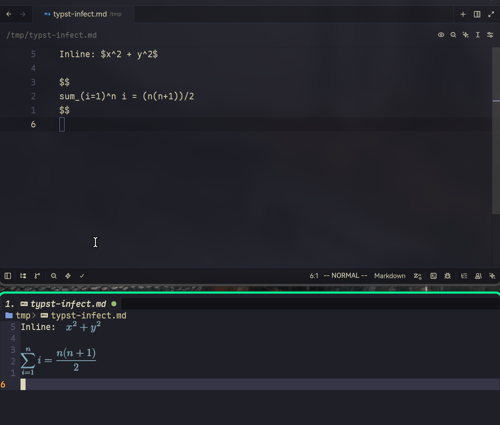

# typst-infect.nvim

Inject [Typst](https://typst.app/) into Markdown math spans:

```markdown
Inline math: $x^2 + y^2$

$$
sum_(i=1)^n i = (n(n+1))/2
$$
```




## Requirements

- Neovim 0.11+
- Tree-sitter parsers: `markdown`, `markdown_inline`, and `typst`
- [snacks.nvim](https://github.com/folke/snacks.nvim)
- `typst`
- ImageMagick, GhostScript

## Installation

### lazy.nvim

```lua
{
  "js0ny/typst-infect.nvim",
  lazy = false,
  dependencies = {
    "folke/snacks.nvim",
  },
  opts = {
    markdown = {
      enabled = true,
    },
  },
}
```

`markdown.enabled = true` is the default. To enable the behaviour only in trusted project directories, set it to `false` in the global configuration:

```lua
opts = {
  markdown = {
    enabled = false,
  },
}
```

Then enable it from the project's `.nvim.lua` or `.exrc`:

```lua
require("typst-infect").setup({
  markdown = {
    enabled = true,
  },
})
```

The local configuration must run before a Markdown parser is created. Neovim's `exrc` and local-config trust settings still apply.

### Nix

Using overlay 

```nix
{
  nixpkgs.overlays = [ inputs.typst-infect.overlays.default ];
}
```

It exposes the plugin as `pkgs.vimPlugins.typst-infect`.

#### Nixvim

Add the module to a Nixvim configuration:

```nix
{
  imports = [ inputs.typst-infect.nixvimModules.default ];

  plugins.typst-infect = {
    enable = true;
    settings.markdown = {
      enabled = true;
    };
  };
}
```


Run `:checkhealth typst-infect` to verify parsers, the Typst executable, and the Snacks Typst image query.

## Development

```bash
just test
just test-snacks /path/to/snacks.nvim
```

## License

SPDX: [MIT](https://spdx.org/licenses/MIT)
